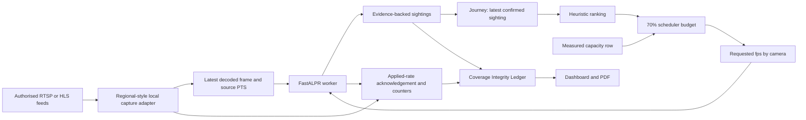
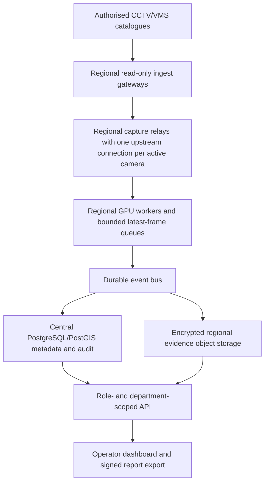

# SakhyaPath Module 4: architecture and deployment design

## What is implemented locally

The prototype uses the Module 1 registry and read-only Sentinel catalogue adapter, Module 2 plate workers, and Module 3 evidence journey. Module 4 adds a measured frame budget, deterministic camera ranking, live worker rate changes, persisted schedule revisions, an operational coverage ledger, a dashboard, and the same records in the PDF report. The current process uses FastAPI, SQLite, one shared FastALPR model, a maximum of four analysis camera workers by default, and a single active pursuit. A registered camera is never treated as an actively analyzed stream merely because it appears on the map.

The current ranking is a transparent heuristic. Straight-line distance, observed feed health, resolution as an uncalibrated readability proxy, measured decoded-frame queue age when available, and resolution as a cost proxy determine order. It makes no route-probability claim. It does not infer direction or road travel time without a verified road network and a common clock. The last evidence-supported confirmed sighting drives the ranking; candidates and rejected reads cannot move it. All permitted candidates remain listed, and cameras outside the worker budget are explicitly marked as coverage gaps.

## Current data flow

Every schedule revision stores its measurement ID, latest confirmed sighting ID, input signature, reason, requested fps and applied acknowledgement. The worker changes sampling without restarting capture. The ledger stores baseline counters at window opening and final counters when a revision closes, so later analysis cannot inflate an older window. Window timestamps are server operational UTC. Source PTS stays a per-stream media timebase; it is not converted into shared event UTC without an attested mapping.

The ledger codes are `observed`, `not observed in sampled frames`, `feed unavailable`, and `insufficient coverage`. `Observed` requires a supported confirmed sighting and analyzed frames in the window. A negative result requires sufficient actual sampled frames; it is never proof of absence from the road or unsampled video. A failed capture and an excluded or undersampled camera are shown separately. Capture/decode exceptions and health are recorded along with received, planned and analyzed counts.

## Capacity contract

Run the local end-to-end benchmark on owned feeds. If its observed sustainable rate is **M analyzed fps** for the measured codec, resolution, model and host, the maximum scheduler budget is **B = 0.70 × M fps**. The remaining 30% is reserved for decode, APIs, UI and spikes. Existing manual workers reserve their requested rates within B. The scheduler refuses to start without a measurement and rejects manual rate changes that would exceed an active pursuit budget. A worker's applied rate is acknowledged only after real inference at that rate; requested rates are not presented as delivered coverage. Model inference latency alone is not used as M.

The local mixed H.264/H.265 two-feed run at 960×540 measured 249 analyzed frames in 20.634 seconds (**12.067 fps**), yielding a stored **8.447 fps** scheduler ceiling. It decoded 498 frames and reported CUDA execution, sampled model latency p95 of 76.45 ms, peak GPU utilization of 100%, peak backend process RAM of 1007.1 MiB, and 5,302,451 relay-path bytes in each direction. Both publishers and the analyzer shared one laptop, so this is a narrow local calibration. [Raw benchmark record](../output/benchmarks/module4_owned_pipeline.json) contains the exact conditions and limitations.

For a pilot with `N` concurrent analyzed cameras at average `r` fps, minimum worker replicas are `ceil(N × r / B_worker)` under equivalent measured conditions, plus spare capacity for failover. The same formula must be rerun for each codec, resolution, model version and server class. Stream bandwidth is `N × average encoded bitrate`; storage is `event count × evidence bytes × retention period` plus metadata, replicas and backups. These are sizing equations, not a claim that 80,000 streams have been tested.

An 80,000-camera **registry** can be partitioned by region without opening all streams. Ingest and inference are on-demand, with a regional baseline and explicit uncovered cameras when capacity is constrained. A hypothetical 80,000 × 1 fps simultaneous analysis would require 80,000 analyzed fps plus resilience and is outside this prototype's demonstrated capacity. A procurement estimate must use measured feed mixes, GPU utilization, bandwidth, camera duty cycle, coverage target, failover reserve, and local infrastructure prices.

## Proposed production topology

The pilot starts with roughly 50 authorized feeds and measures actual concurrent decoded, viewed and analyzed counts separately. Then add a regional deployment with local ingest and GPU workers, compare latency and recovery across regional links, and finally shard the registry across regions. Federated VMS credentials remain in a regional secret manager. The central service receives event metadata and permitted evidence, not every raw statewide stream. Retain source PTS, timebase, stream generation, source mode, receive-time diagnostic, and any separately verified event-time mapping through every hop.

PostgreSQL/PostGIS replaces SQLite for production transactions and spatial queries; the schema migrates camera, sighting, alert, review, schedule, and coverage tables with immutable event IDs. Partition high-volume events by region and time. Use a durable message broker for sighting/health events, a distributed worker lease with bounded expiry for each active camera, and object storage for evidence with SHA-256 verification. The relay must be load-tested to prove that it does not multiply upstream connections or erase timing provenance.

## Access, protection and operations

- Terminate TLS at approved ingress and use mTLS or equivalent authenticated service links between regional components. Store camera credentials and API tokens in a secret manager; never send raw feed URLs or credentials to the browser.
- Enforce identity, role and department scope on camera, sighting, evidence, schedule and report endpoints. Use short-lived sessions, CSRF protection for browser writes, audit records for reviews/exports, and separate service credentials for worker acknowledgements.
- Encrypt metadata backups and evidence at rest. Set retention, deletion holds, and disclosure policy with the responsible Government authority before production; the prototype has no approved retention policy.
- Monitor discovered/connected/viewed/analyzed counts, worker applied versus requested fps, queue age, GPU/CPU/RAM/network, capture retries, p95 frame-to-alert latency, model errors, evidence-hash failures and the distribution of all four ledger states. Alert on a persistent gap or missed capacity acknowledgement.
- On worker failure, expire the lease, mark coverage insufficient or feed unavailable, move eligible work to spare capacity, and preserve schedule revisions. Test regional link loss and central database failover before any live operational claim.
- Back up PostgreSQL and evidence with region-approved encryption and recovery objectives. Rehearse restore and hash verification; a backup configuration alone is not disaster-recovery proof.

## Gates still open

No Sentinel sandbox URL, credentials, or network permission have been supplied. Therefore the real read-only `GET /api/ingest` catalogue, Government live-feed capture, Government feed load test, and mandatory live demo remain pending. Cross-camera UTC timing is exact only where an owned recording clock has been attested. Indian plate accuracy, regional security review, retention approval, backup restore, failover, and statewide capacity are not validated by the local demonstration.
